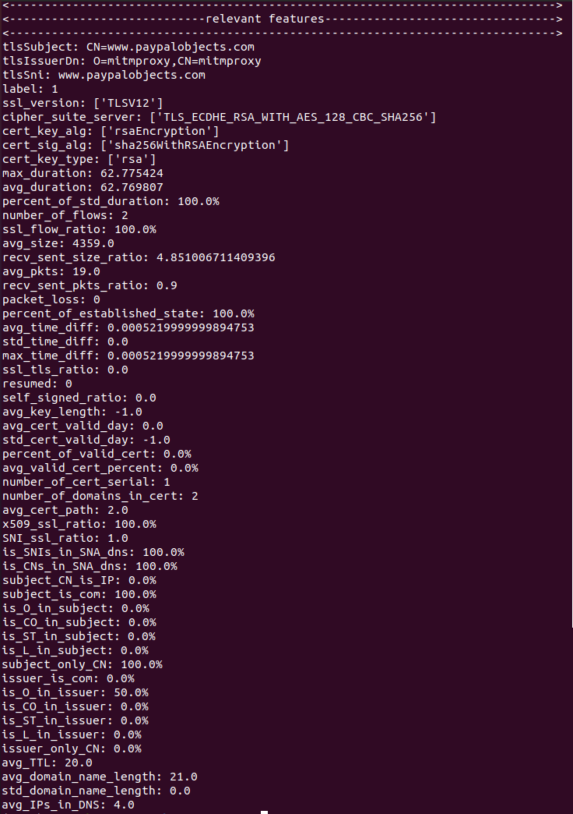

# 使用机器学习的恶意加密流量识别系统


## requirements environment

| Tools / Packages | Version                        |
| ---------------- | ------------------------------ |
| platform         | Ubuntu Linux 20.04**(>18.04)** |
| Python           | **3.7（IMPORTANT）**           |
| anaconda         | -                              |
| zeek             | **3.1.3**                      |
| sklearn          | 0.22                           |
| tensorflow       | 1.15.0**(<2.0)**               |
| lightgbm         | 3.1.1                          |
| xgboost          | 1.5.1                          |
| csv              | -                              |
| pandas           | -                              |
| joblib           | -                              |
| spicy            | -                              |
| gensim           | -                              |
| pickle           | -                              |
| numpy            | -                              |

The bolded section indicates that using that version is mandatory, while the non-bolded section suggests that the mentioned version is available, but other versions may also be viable. A hyphen (-) indicates that it is not important.

## 运行

1. Place the pcap file to be detected in the project directory.
2. Run project.py by executing the following command:

   \````python project.py```

3. The program will prompt "please input the IP that to be detected:", indicating the input for the target IP to be detected.

4. The user enters the IP, and the program starts running.

5. The program prints the detection results of each module and the extracted data features as shown in the following figure.





## Dataset source

Module one's data is sourced from: [2020 West Lake Sword Malicious Encrypted Traffic Detection Competition Topic](https://www.gcsis.cn/)

Module two's data is extracted from: [The Malware Capture Facility Project is an effort from the Czech Technical University AIC Group](https://mcfp.felk.cvut.cz/publicDatasets/datasets.html)


## Explaination

1. For Module One, the data fields are as follows:

   | Standard Field | Example                                                      |
   | -------------- | ------------------------------------------------------------ |
   | eventId        | d93d6ffd-55ae-4e65-bf28-a90bcf90b824                         |
   | srcAddress     | 172.16.0.108                                                 |
   | srcPort        | 63415                                                        |
   | destAddress    | 10.193.90.150                                                |
   | destPort       | 443                                                          |
   | appProtocol    | tls                                                          |
   | tlsSubject     | C=US, ST=WA, L=Redmond, O=Microsoft, OU=WSE, CN=settings-win.data.microsoft.com |
   | tlsIssuerDn    | C=US, ST=Washington, L=Redmond, O=Microsoft Corporation, CN=Microsoft Secure Server CA 2011 |
   | tlsSni         | settings-win.data.microsoft.com                              |
   | tlsVersion     | TLS 1.2                                                      |
   | bytesOut       | 9832                                                         |
   | bytesIn        | 2760                                                         |
   | pktsIn         | 24                                                           |
   | pktsOut        | 20                                                           |
   | label          | 1                                                            |

   2.For Module 2, the field definitions are as follows：

   | ***\*1. Traffic statistics characteristic field\**** | ***\*Field role\****                                         |
   | ---------------------------------------------------- | ------------------------------------------------------------ |
   | number_of_flows                                      | Corresponds to the number of all connection flows in the IP connection, including TLS connections and non-TLS connections. |
   | packet_loss                                          | The total number of packets lost in the connection corresponding to the IP |
   | max_duration                                         | Maximum duration of session                                  |
   | avg_duration                                         | average session time                                         |
   | avg_size                                             | average package size                                         |
   | recv_sent_size_ratio                                 | Traffic data sending and receiving rates                     |
   | avg_pkts                                             | Average number of packets per session                        |
   | recv_sent_pkts_ratio                                 | Traffic packet sending and receiving rate                    |
   | avg_time_diff                                        | Average time difference between two packets in a session     |
   | std_time_diff                                        | Standard deviation of the time difference between two packets in the session |
   | max_time_diff                                        | Maximum time difference between two packets in a session     |
   | ***\*2.SSL session characteristic field\****         | ***\*Field role\****                                         |
   | ssl_version                                          | ssl version used for encrypted traffic                       |
   | cipher_suite_server                                  | The cipher suite version selected by the server              |
   | resumed                                              | Identifies how many conversations with this IP have been reused |
   | SNI_ssl_ratio                                        | The rate of SNI included in SSL connections. SNI stands for Server Name Indication and is an extension of the TLS/SSL protocol. It allows the client to explicitly specify the hostname of the server it wishes to connect to when starting the TLS handshake. In this way, the server can select the correct certificate for verification based on the host name requested by the client, thereby supporting HTTPS services for multiple domain names on the same IP address and port. Without the SNI extension, the server can only determine which certificate to respond to based on the IP address and port number, which means that only one HTTPS service can be served on the same IP address and port. With the SNI extension, the server can provide HTTPS services for multiple domain names on the same IP address and port, making it more flexible and efficient. |
   | ***\*3. Certificate characteristic fields\****       | ***\*Field role\****                                         |
   | cert_sig_alg                                         | The encryption algorithm used for certificate signing        |
   | avg_cert_valid_day                                   | Average certificate validity time                            |
   | std_cert_valid_day                                   | Certificate validity time standard deviation                 |
   | percent_of_valid_cert                                | Proportion of valid certificates                             |
   | avg_cert_path                                        | The length of the average certificate chain used during the SSL/TLS handshake, in units of number of certificates |
   | cert_key_type                                        | Indicates the type of key used. Specifically, the key_type field can indicate whether an RSA key, a Diffie-Hellman key, an elliptic curve key, etc. are used. |
   | number_of_domains_in_cert                            | The specific number of DNS domain names included in the Subject Alternative Name (SAN) extension used to record the certificate |
   | avg_valid_cert_percent                               | Average proportion of valid certificates                     |
   | subject_CN_is_IP                                     | Whether the common authority name of the certificate subject is IP instead of domain name |
   | subject_only_CN                                      | Whether there is only information about the CN field in the subject of the certificate |
   | is_O_in_issuer                                       | The O field of the certificate issuing authority refers to the name of the organization or company of the certificate holder. |
   | is_O_in_subject                                      | Whether there is an O field in the certificate subject, which refers to the name of the organization or company of the certificate holder |
   | is_CNs_in_SAN_dns                                    | Identifies whether the subject field of the certificate also appears in the domain name included in the SAN extension. It uses the san.dns field of the zeek certificate, which is used to record the DNS name contained in the certificate's Subject Alternative Name (SAN) extension. SAN extension is an optional X.509 certificate extension that allows the holder of a certificate to include multiple subject names in the same certificate, including IP addresses and DNS names, etc. |
   | is_ST_in_subject                                     | The ST field refers to the name of the state or province where the entity involved in the certificate is located. |
   | ***\*4. Background DNS traffic characteristics\****  | ***\*Field role\****                                         |
   | avg_domain_name_length                               | Average domain name length                                   |
   | std_domain_name_length                               | The standard deviation of the length of the queried domain name |
   | avg_IPs_in_DNS                                       | Number of IPs included in DNS query results                  |
   | avg_TTL                                              | Indicates how long a resource record remains alive in the DNS cache. |


## Accuracy

module1：

|                         | ***\*f1 score\**** | ***\*precision_score\**** | ***\*recall_score\**** | accuracy score |
| ----------------------- | ------------------ | ------------------------- | ---------------------- | -------------- |
| ***\*Random Forest\**** | 0.9296             | 0.8922                    | 0.9823                 | 0.9762         |
| ***\*GBDT\****          | 0.9764             | 0.9590                    | 0.9945                 | 0.9917         |


GBDT Model

|                         | ***\*f1 score\**** | ***\*precision_score\**** | ***\*recall_score\**** | *accuracy score* |
| ----------------------- | ------------------ | ------------------------- | ---------------------- | ---------------- |
| ***\*Random Forest\**** | 0.8958             | 0.8219                    | 0.9844                 | 0.9130           |
| ***\*GBDT\****          | 0.8420             | 0.7334                    | 0.9884                 | 0.8522           |


## Principle and Replacement of Kernel Detection Module


1. Module Principle

   This system is divided into three layers: the user interaction layer, the feature extraction layer, and the kernel analysis layer. The calling relationships and hierarchical structure of each layer are illustrated in the diagram below:


2. Model Replacement

   Here, we will explain how to replace the random forest model in Module 2 with a new one using new training data:

   1. Obtain a malicious software and capture the data it sends. For example, we will use a traffic packet from "The Malware Capture Facility Project is an effort from the Czech Technical University AIC Group."
   2. Analyze the file using [VirusTotal](https://www.virustotal.com/). The results are shown in the following figure:
   
   
   
   
   
   
   
   
   
   3. Clicking on "RELATIONS," as shown in the figure, will display the IP addresses and domains associated with the malicious software. To mark all the IP addresses related to it as malicious in the pcap file.
   
   
   
   
   
   
   
   4. Analyze the pcap traffic file using Zeek. Place the resulting files in the "Malicious" folder under the path "project/module2/dataset/Malicious/(custom)/bro". The Zeek-generated files should be placed in a subfolder named "/bro". For example, the final folder structure would be: "/Desktop/project/module2/dataset/Malicious/(custom)/bro".
   
      **Note: "(custom)" can be replaced with any custom name. You can process multiple files simultaneously by placing them in separate folders, such as "test1/bro" and "test2/bro", and putting the corresponding content in the respective directories.**
   
   5. Create an "IPadr.txt" file within the corresponding folder. The file should contain the following content:
   
   ```
   Malicious
   20.190.160.129
   92.240.254.113
   (Include all the malicious IPs you obtained)
   ```
   
   6. In the "project/module2/feature_extract" directory, run "\_\_label\_\_log" first, then run "module2main.py" (please modify the file content as necessary to ensure proper execution). The resulting dataset will be stored in the "project/module2/dataset/data_model" directory. Note that multiple datasets will be generated, with the largest dataset combining all the data.
   
      **Please ensure that the files obtained in step 4 contain "conn.log", "ssl.log", "dns.log", and "X509.log". Also, make sure that the IPs listed in "IPadr.txt" have corresponding records in "ssl.log". Otherwise, the resulting dataset in this step will not contain any data.**
   
   7. At this point, you will have a dataset consisting entirely of malicious traffic data, including the corresponding features.

   8. Using a similar approach, obtain a dataset of normal traffic. Note that before training, you should change the label in the dataset to "0" to differentiate it from the malicious data.
   
   9. Merge the two datasets and encode non-numeric fields. Save the encoding rules as a dictionary (to facilitate future encoding of new data using the same dictionary). **It is recommended to use frequency encoding and encode non-numeric classes with a frequency less than 3 into a single class "X". This way, if the corresponding value is not found in the encoding dictionary, it can be automatically converted to "X".**
   
   10. Train the model and optimize hyperparameters.
   
   
   
   The principle of feature extraction is shown in the following diagram:
   
   
   
   ## To Be Continued
   
   For the classification of malicious traffic, an additional dataset was collected. The data comes from [CSE-CIC-IDS2018](https://www.unb.ca/cic/datasets/ids-2018.html), which is a collaborative project between the Communications Security Establishment (CSE) and the Canadian Institute for Cybersecurity (CIC). It uses real captured network traffic packets, which are then analyzed using [CICFlowMeter](https://github.com/ahlashkari/CICFlowMeter) to extract 79-dimensional flow data features from the packets. Each flow information is annotated with the corresponding attack category based on the actual situation.
   
   After sampling the dataset, it was used for model training. The obtained classification training results are as follows:
   
   | ***\*Random Forest\**** | ***\*precision\**** | ***\*recall\**** | ***\*f1-score\**** | ***\*Numbers\**** |
   | ----------------------- | ------------------- | ---------------- | ------------------ | ----------------- |
   | Benign                  | 0.98                | 0.98             | 0.98               | 37143             |
   | Brute Force             | 0.82                | 0.84             | 0.83               | 403               |
   | XSS                     | 0.63                | 0.55             | 0.59               | 166               |
   | SQL Injection           | 0.76                | 0.70             | 0.73               | 230               |
   | Infilteration           | 0.51                | 0.41             | 0.45               | 1551              |
   | SSH-Bruteforce          | 0.97                | 0.98             | 0.97               | 993               |
   | ***\*GBDT\****          | ***\*precision\**** | ***\*recall\**** | ***\*f1-score\**** | ***\*Numbers\**** |
   | Benign                  | 1.00                | 1.00             | 1.00               | 37143             |
   | Brute Force             | 1.00                | 0.99             | 0.99               | 403               |
   | XSS                     | 0.99                | 1.00             | 0.99               | 166               |
   | SQL Injection           | 0.92                | 1.00             | 0.96               | 230               |
   | Infilteration           | 1.00                | 1.00             | 1.00               | 1551              |
   | SSH-Bruteforce          | 1.00                | 1.00             | 1.00               | 993               |
   
   
   
   However, due to my limited knowledge in Java and difficulty in configuring the relevant environment for CICFlowMeter, the integration of CICFlowMeter into the current system has not been implemented yet.
   
   
   
   
   
   
   
   
