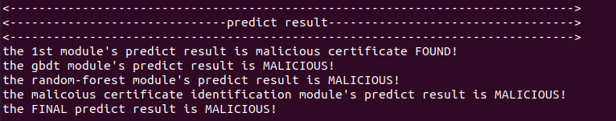
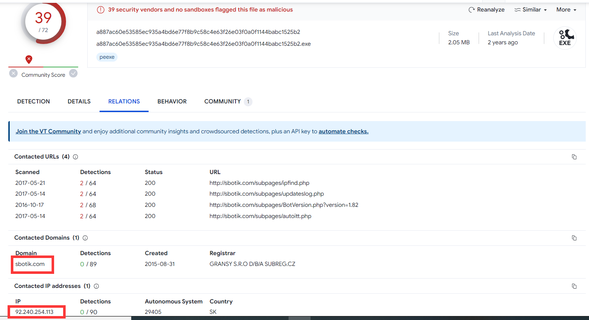

# 使用机器学习的恶意加密流量识别系统


## 需求环境

| Tools / Packages | Version                                                     |
| ---------------- | ----------------------------------------------------------- |
| 平台             | Ubuntu Linux 20.04**(>18.04)**                              |
| Python           | **3.7（很重要，该版本可同时适配指定zeek版本和机器学习库）** |
| anaconda         | -                                                           |
| zeek             | **3.1.3**                                                   |
| sklearn          | 0.22                                                        |
| tensorflow       | 1.15.0**(<2.0)**                                            |
| lightgbm         | 3.1.1                                                       |
| xgboost          | 1.5.1                                                       |
| csv              | -                                                           |
| pandas           | -                                                           |
| joblib           | -                                                           |
| spicy            | -                                                           |
| gensim           | -                                                           |
| pickle           | -                                                           |
| numpy            | -                                                           |

加粗部分表示一定要使用该版本，未加粗部分则表示该版本可用，但其他版本也许可行。-表示不重要。


## 运行

1. 将待检测的pcap包放在project目录下；
2. 运行project.py；

``` python project.py``` 

3. 程序提示"please input the IP that to be detected:",提示输入待检测的目标ip；

4. 用户输入ip，程序开始运行；

5. 程序打印各个模块的检测结果及提取的数据特征如下图所示；




## 数据集来源

模块一的数据来源于：[2020西湖论剑恶意加密流量检测方向赛题](https://www.gcsis.cn/)

模块二的数据提取自：[The Malware Capture Facility Project is an effort from the Czech Technical University AIC Group](https://mcfp.felk.cvut.cz/publicDatasets/datasets.html)


## 字段解释

1. 对于模块一，其中的数据字段如下：

   | 标准字段字段 | 字段含义                | 样例                                                         |
   | ------------ | ----------------------- | ------------------------------------------------------------ |
   | eventId      | 事件ID                  | d93d6ffd-55ae-4e65-bf28-a90bcf90b824                         |
   | srcAddress   | 来源地址                | 172.16.0.108                                                 |
   | srcPort      | 来源端口                | 63415                                                        |
   | destAddress  | 目的地址                | 10.193.90.150                                                |
   | destPort     | 目的端口                | 443                                                          |
   | appProtocol  | 应用协议                | tls                                                          |
   | tlsSubject   | TLS证书主题             | C=US, ST=WA, L=Redmond, O=Microsoft, OU=WSE, CN=settings-win.data.microsoft.com |
   | tlsIssuerDn  | TLS证书持有人唯一标识符 | C=US, ST=Washington, L=Redmond, O=Microsoft Corporation, CN=Microsoft Secure Server CA 2011 |
   | tlsSni       | TLS证书标记             | settings-win.data.microsoft.com                              |
   | tlsVersion   | TLS版本                 | TLS 1.2                                                      |
   | bytesOut     | 发送到客户端字节数      | 9832                                                         |
   | bytesIn      | 发送到服务端字节数      | 2760                                                         |
   | pktsIn       | 发送到客户端数据包数    | 24                                                           |
   | pktsOut      | 发送到服务端数据包数    | 20                                                           |
   | label        | 是否是恶意加密流量      | 1                                                            |

   2.对于模块2，其中的字段释义如下：

   | ***\*1.流量统计特征字段\**** | ***\*字段作用\****                                           |
   | ---------------------------- | ------------------------------------------------------------ |
   | number_of_flows              | 对应ip连接中所有的连接流数，包含TLS连接和非TLS连接           |
   | packet_loss                  | 对应ip的连接中总丢失的包数量                                 |
   | max_duration                 | 会话的最长时间                                               |
   | avg_duration                 | 会话的平均时间                                               |
   | avg_size                     | 包的平均大小                                                 |
   | recv_sent_size_ratio         | 流量数据的发送和接收率                                       |
   | avg_pkts                     | 会话的平均包数                                               |
   | recv_sent_pkts_ratio         | 流量包的发送和接收率                                         |
   | avg_time_diff                | 会话中两个包平均时间差                                       |
   | std_time_diff                | 会话中两个包时间差标准差                                     |
   | max_time_diff                | 会话中两个包最大时间差                                       |
   | ***\*2.SSL会话特征字段\****  | ***\*字段作用\****                                           |
   | ssl_version                  | 加密流量使用的ssl版本                                        |
   | cipher_suite_server          | 服务器选用的加密套件版本                                     |
   | resumed                      | 标识和该ip的通讯有多少对话经过了复用                         |
   | SNI_ssl_ratio                | ssl连接中包含SNI的比率。SNI代表服务器名称指示（Server Name Indication），是TLS/SSL协议的一个扩展。它允许客户端在开始TLS握手时，明确指定它希望连接的服务器的主机名。这样，服务器就可以根据客户端请求的主机名来选择正确的证书进行验证，从而支持在同一IP地址和端口上提供多个域名的HTTPS服务。在没有SNI扩展的情况下，服务器只能根据IP地址和端口号来确定要响应的证书，这意味着在同一IP地址和端口上只能提供一种HTTPS服务。而有了SNI扩展，服务器就可以在同一IP地址和端口上提供多个域名的HTTPS服务，从而更加灵活和高效 |
   | ***\*3.证书特征字段\****     | ***\*字段作用\****                                           |
   | cert_sig_alg                 | 证书签名所使用的加密算法                                     |
   | avg_cert_valid_day           | 证书平均有效时间                                             |
   | std_cert_valid_day           | 证书有效时间标准差                                           |
   | percent_of_valid_cert        | 有效证书的比例                                               |
   | avg_cert_path                | 与SSL/TLS握手过程中使用的平均证书链的长度，以证书数量为单位  |
   | cert_key_type                | 指示所使用的密钥类型。具体而言，key_type字段可以指示使用的是RSA密钥、Diffie-Hellman密钥还是椭圆曲线密钥等。 |
   | number_of_domains_in_cert    | 用于记录证书的主题备用名称（Subject Alternative Name，SAN）扩展中包含的DNS域名的具体数量 |
   | avg_valid_cert_percent       | 平均有效证书的比例                                           |
   | subject_CN_is_IP             | 证书主题的通用机构名是否为IP而不是域名                       |
   | subject_only_CN              | 证书的主题中是否只有CN字段的信息                             |
   | is_O_in_issuer               | 证书证书颁发机构的O字段,该字段是指证书持有人的组织或者公司的名称 |
   | is_O_in_subject              | 证书主题是否存在O字段,该字段是指证书持有人的组织或者公司的名称 |
   | is_CNs_in_SAN_dns            | 标识证书的主题字段是否同样出现在SAN扩展包含的域名中。它使用了zeek证书的san.dns字段，san.dns字段用于记录证书的主题备用名称（Subject Alternative Name，SAN）扩展中包含的DNS名称。SAN扩展是一种可选的X.509证书扩展，它允许证书的持有者在同一证书中包含多个主题名称，包括IP地址和DNS名称等 |
   | is_ST_in_subject             | ST字段指的是证书所涉及实体的所在州或省份的名称               |
   | ***\*4.背景DNS流量特征\****  | ***\*字段作用\****                                           |
   | avg_domain_name_length       | 平均域名长度                                                 |
   | std_domain_name_length       | 查询到的域名的长度的标准差                                   |
   | avg_IPs_in_DNS               | DNS查询结果中包含的IP数                                      |
   | avg_TTL                      | 表示资源记录在DNS缓存中存活的时间                            |


## 准确率

模块2：

随机森林模型

| ***\*模型选择\**** | ***\*f1 score\**** | ***\*precision_score\**** | ***\*recall_score\**** | accuracy score |
| ------------------ | ------------------ | ------------------------- | ---------------------- | -------------- |
| ***\*随机森林\**** | 0.9296             | 0.8922                    | 0.9823                 | 0.9762         |
| ***\*GBDT\****     | 0.9764             | 0.9590                    | 0.9945                 | 0.9917         |


GBDT模型

| ***\*模型选择\****     | ***\*f1 score\**** | ***\*precision_score\**** | ***\*recall_score\**** | *accuracy score* |
| ---------------------- | ------------------ | ------------------------- | ---------------------- | ---------------- |
| ***\*随机森林模型\**** | 0.8958             | 0.8219                    | 0.9844                 | 0.9130           |
| ***\*GBDT模型\****     | 0.8420             | 0.7334                    | 0.9884                 | 0.8522           |


## 内核检测模块原理及替换


1. 模块原理

本系统共分为3层,分别为用户交互层,特征提取层,内核分析层。各层的调用关系和层次结构如图所示：


2. 模型替换

   这里以替换模块2中随机森林模型为例讲解如何使用新的训练数据进行替换：

   1. 得到一个恶意软件，并捕获它所发送的数据，这里我们以The Malware Capture Facility Project is an effort from the Czech Technical University AIC Group中的某流量包为例；

   2. 使用[virustotal](https://www.virustotal.com/)对文件进行分析，结果如下图所示：

      

      

      

      3. 点击RELATIONS,在如图所示的位置可以看到恶意软件形成联系的ip和域名，将pcap包中与之相关的ip全部标记为malicious.

      

      

      4. 将pcap流量包使用zeek进行分析。将得到的文件放在project/module2/dataset/Malicious文件夹下，将zeek得到的文件放在子文件夹的/bro文件夹下，最终形成的文件夹路径如下：/Desktop/project/module2/dataset/Malicious/(自定义)/bro
   
         **注意：（自定义）这里可以同时放入很多文件批量处理，比如你可以同时分析很多个pcap包，然后命名test1/bro;test2/bro，将对应的内容分别放在相应的目录下即可**
   
      5. 在对应的文件内添加IPadr.txt文件，文件内容如下：
   
      ```
      Malicious
      20.190.160.129
      92.240.254.113
      (你所得到的全部恶意ip都可以放在里面)
      ```
   
      6. 在project/module2/feature_extract目录下，先运行\_\_label\_\_log,再运行module2main.py(请适当修改文件内容使其正常运行），最终得到的数据集放在project/module2/dataset/data_model目录下。注意会产生多个数据集，而最大的那个数据集合并了所有数据。
   
         **值得注意的是，请确保你在第四步得到的文件中含有conn.log,ssl.log,dns.log,X509.log，且你放在IPadr.txt文件中的ip在ssl.log中产生过对应的记录,否则这一步得到的数据集将不包含任何数据.**
   
      7. 这样你就得到了一份全是恶意流量数据的数据集,含有对应的特征.
      8. 使用类似的手段，获得正常流量的数据集，值得注意的地方是，请在训练之前将数据集中的label改为0，以和恶意数据作区分；
      9. 将两个数据集合并，对某些非数值字段进行编码并将编码规则保存为字典（方便后续新的数据输入时使用该字典转化为编码）,**建议使用频次编码,并且将频次小于3的非数值类统一编码为一类X,这样若输入的数据在对应的编码字典中找不到对应值时可以自动被转化为x**;
      10. 训练模型并优化超参数.

      
   
      其中特征提取的原理如图所示:
   
      
   
   ## 未完成的工作
   
   针对恶意流量的分类，额外收集了一个数据集。数据来自[CSE-CIC-IDS2018](https://www.unb.ca/cic/datasets/ids-2018.html)，它是一个通信安全机构（CSE）和加拿大网络安全研究所（CIC）之间的合作项目。它使用真实的捕获到的网络流量数据包，然后使用 [CICFlowMeter](https://github.com/ahlashkari/CICFlowMeter)对流量包进行分析，从流量包中提取79维流量数据特征，并根据实际情况对每一条流量信息进行攻击种类的标注。
   
   
   
   对数据集进行采样后，将其送入模型训练。得到的分类训练结果如下所示：
   
   | ***\*随机森林模型\**** | ***\*precision\**** | ***\*recall\**** | ***\*f1-score\**** | ***\*Numbers\**** |
   | ---------------------- | ------------------- | ---------------- | ------------------ | ----------------- |
   | Benign                 | 0.98                | 0.98             | 0.98               | 37143             |
   | Brute Force            | 0.82                | 0.84             | 0.83               | 403               |
   | XSS                    | 0.63                | 0.55             | 0.59               | 166               |
   | SQL Injection          | 0.76                | 0.70             | 0.73               | 230               |
   | Infilteration          | 0.51                | 0.41             | 0.45               | 1551              |
   | SSH-Bruteforce         | 0.97                | 0.98             | 0.97               | 993               |
   | ***\*GBDT模型\****     | ***\*precision\**** | ***\*recall\**** | ***\*f1-score\**** | ***\*Numbers\**** |
   | Benign                 | 1.00                | 1.00             | 1.00               | 37143             |
   | Brute Force            | 1.00                | 0.99             | 0.99               | 403               |
   | XSS                    | 0.99                | 1.00             | 0.99               | 166               |
   | SQL Injection          | 0.92                | 1.00             | 0.96               | 230               |
   | Infilteration          | 1.00                | 1.00             | 1.00               | 1551              |
   | SSH-Bruteforce         | 1.00                | 1.00             | 1.00               | 993               |
   
   
   
   但是，由于本人是java小白，配置不好cicflowmeter的相关环境，因此将其耦合入本系统的目标尚未实现。
   
   
   
   
   
   
   
   